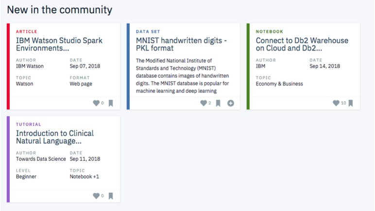

# Data Scientist Nanodegree

## Recommendation Engines

## Project: Recommendations with IBM

## Table of Contents

- [Project Introduction](#intro)
- [Exploratory Data Analysis](#eda)
- [Rank Based Recommendations](#rank)
- [User-user Based Collaborative Filtering](#user-user)
- [Matrix Factorisation](#matrix_fac)
- [Conclusion](#conclusion)
- [Files](#files)
- [Software and Libraries](#sw_lib)

***

## Project Introduction

For this project I will analyze the interactions that users have with articles on the **IBM Watson Studio platform,** and make recommendations to them about new articles I think they will like. Below is an example of what the dashboard could look like displaying articles on the IBM Watson Platform.

## Exploratory Data Analysis

Before making recommendations of any kind, I explored the data for this project. Dive in to see what you can find.

Most of the users have maximum 3 interactions with any article on the platform and this distribution is highly **skewed** because interactions are less.

## Rank Based Recommendations

To get started in building recommendations, I first found out the most popular articles simply based on the most interactions. Since there are no ratings for any of the articles, it is easy to assume the articles with the most interactions are the most popular. These are then the articles we might recommend to new users (or anyone depending on what we know about them).

This type of recommendation system provide the top articles view in this dataset.

## User-user Based Collaborative Filtering

In order to build better recommendations for the users of IBM's platform, we looked at users that are similar in terms of the items they have interacted with. These items then recommended to the similar users. This was the step in the right direction towards more personal recommendations for the users.

I also provide a `user_id` for which I want recommendations. Then sorted each user based on similarity with the given `user_id`.

For each sorted user, it was found out the articles this sorted user has interacted with to add to recommedations list.

Then selected the top m recommendations, m being the number of recommendations to provide for a specific `user_id`.

## Matrix Factorisation

In this section I first perform SVD on the user_item interactions matrix. Then it can be seen that the behaviour of accuracy with the number of latent features. Since the data is highly imbalanced, I also need to check the variation of F1 score with the number of latent features. F1 score increases upto a limit and then drops asymptotically.

## Conclusion

There were only 20 customer for which we can try and provide recommendation. If we had more data then performance of our recommendation engine could be evaluated more efficiently. We have a highly imbalanced data because of many zeroes in the user-item interaction matrix. I will try **content recommendation** in future iteractions to tackle the **cold start problem**.

## Files

<pre>
.
├── data
│   ├── articles_community.csv-------------# INFORMATION ABOUT ARTICLES
│   └── user-item-interactions.csv---------# USER-ARTICLE INTERACTIONS
├── images
│   ├── image-1.jpg------------------------# IBM Dashboard Image
├── Recommendations_with_IBM.html----------# HTML EXPORT OF JUPYTER NOTEBOOK
├── Recommendations_with_IBM.ipynb---------# ANALYSIS NOTEBOOK
├── project_tests.py-----------------------# UNIT TESTS FOR PROJECT
├── visuals.py-----------------------------# CUSTOM PLOTS CREATED IN PLOTLY
├── top_10.p-------------------------------# BINARY FILE TO CHECK MY SOLUTION
├── top_20.p-------------------------------# BINARY FILE TO CHECK MY SOLUTION
├── top_5.p--------------------------------# BINARY FILE TO CHECK MY SOLUTION
├── user_item_matrix.p---------------------# BINARY FILE TO CHECK MY SOLUTION
└── requirements.txt-----------------------# Packages required

</pre>

## Software and Libraries

This is project uses Python 3.6.6 and the necessary libraries are mentioned in requirements file.